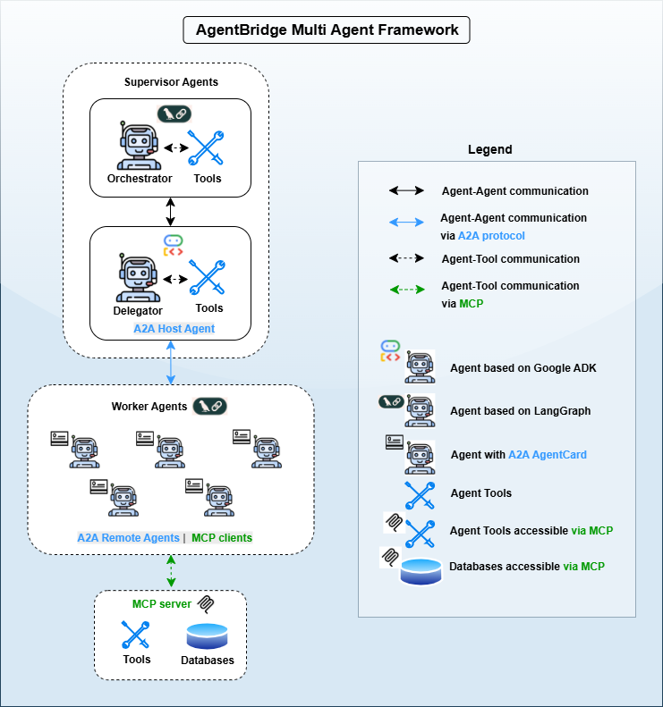
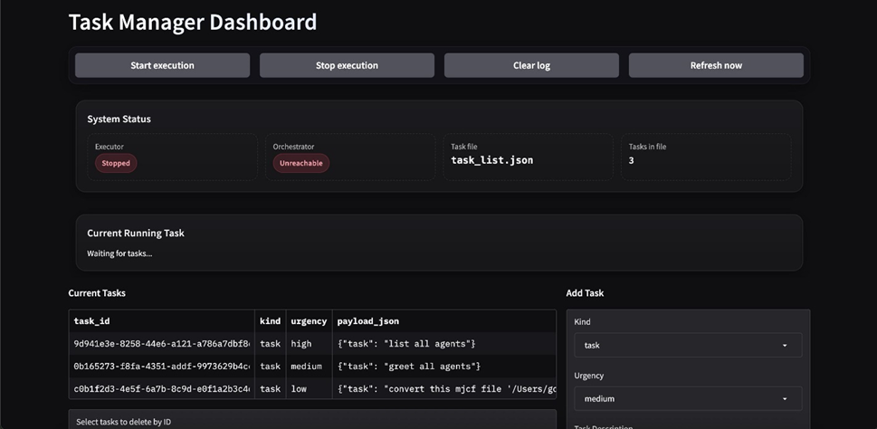

<div align="center">

# AgentBridge


**AgentBridge** is a **multi-agent framework** enabling seamless communication between heterogeneous systems using [**MCP**](https://github.com/modelcontextprotocol) and [**A2A**](https://github.com/a2aproject/A2A). Designed for flexibility, modularity, and distributed orchestration.
</div>

<p align="center">
  
</p>

---

## 📚 Table of Contents
- [✨ Features](#-features)
- [🧩 Architecture](#-architecture)
- [📁 Project Structure](#-project-structure)
- [📦 Installation](#-installation)
- [⚙️ Configuration](#-configuration)
- [🚀 Usage](#-usage)
- [📊 Task Management & Dashboard](#-task-management--dashboard)
- [⚡ Development](#-development)
- [📂 Data Folder](#-data-folder)
- [👤 Author](#-author)
- [📝 License](#-license)

---

## ✨ Features

| Feature                  | Description                                                      |
|---------------------------|------------------------------------------------------------------|
| 🗨️ Agent-to-agent comms   | Seamless interaction via [A2A](https://github.com/a2aproject/A2A) |
| 🧰 Tool integration       | Plug-and-play via [MCP](https://github.com/modelcontextprotocol) |
| 🧭 Dynamic task planning  | Flexible, no rigid workflows                                     |
| ⚡ Fast setup             | Lightweight and quick installation with [`uv`](https://github.com/astral-sh/uv) |
| 🖥️ Dashboard             | Web UI for monitoring and task submission                        |
| 😴 Graceful shutdown      | Safe exit using `q + Enter` or `Ctrl-C`                          |

---

## 🧩 Architecture

### 🤖 Participants

| Role             | Description                                   | Documentation |
|------------------|-----------------------------------------------|---------------|
| **Orchestrator** | Planner agent that dynamically builds task flows | [Orchestrator README](src/agentbridge/agents/supervisors/orchestrator/README.md) |
| **Delegator**    | Dispatches subtasks to the right workers        | [Delegator README](src/agentbridge/agents/supervisors/delegator/README.md) |
| **Worker Agents**| Domain-specific functional agents              | [Workers README](src/agentbridge/agents/workers/README.md) |
| **Dashboard**    | Web interface for task management and monitoring | [Tasks README](src/agentbridge/tasks/README.md) |

### 🛠️ Frameworks Used
- [LangGraph](https://github.com/langchain-ai/langgraph)  
- [Google ADK](https://github.com/google/adk-python)  

### 🔗 Protocols

| Protocol | Purpose                          |
|----------|----------------------------------|
| [A2A](https://github.com/a2aproject/A2A) | Peer-to-peer agent communications |
| [MCP](https://github.com/modelcontextprotocol) | Tool/LLM interface integration   |

---

## 📁 Project Structure

```plaintext
agentbridge/
├── pyproject.toml         # project configuration
├── assets/                # diagrams, screenshots
├── README.md
├── src/
│   └── agentbridge/
│       ├── app/           # frontend / UI application
│       ├── agents/        # orchestrator, delegator, worker agents
│       ├── tools/         # MCP server with tools for workers
│       ├── tasks/         # task manager and dashboard
│       ├── data/          # simulation models and assets
│       ├── start.py       # main entrypoint (CLI wrapper)
│       └── __init__.py
├── config.yaml            # Global config
├── wizard.py              # easy setup wizard GUI
├── run_wizard.sh          # shell script for starting setup wizard
├── start_agentbridge.sh   # shell script for starting agentbridge
├── .env.example           # Template env file
├── .env                   # (user-created, not committed)
├── .gitignore
```

---

## 📦 Installation

Clone the repository and set up the environment:

```bash
git clone https://github.tik.uni-stuttgart.de/ac136360/MT3861_LLM_Communication.git
cd MT3861_LLM_Communication
```

💡 Requires [`uv`](https://github.com/astral-sh/uv)

---

### 📂 Data Folder (Required Before Setup)

Before proceeding with the setup, make sure the **data folder** is correctly placed.

The **data folder** contains essential resources such as simulation models, RAG databases, templates, and example files used by the framework.

It must be located at:
```
src/agentbridge/data/
```

You can obtain the data folder from one of the following sources:

- 🔗 **Download directly** from:  
  [https://bwsyncandshare.kit.edu/s/cwc4XnJnkw6YofN](https://bwsyncandshare.kit.edu/s/cwc4XnJnkw6YofN)
- 💬 **Or request it from the developer (Author)** listed at the end of this README.

Once downloaded, extract it into the `src/agentbridge/` directory so the final structure looks like:

```
src/agentbridge/
├── app/
├── agents/
├── tools/
├── tasks/
├── data/              ← place the downloaded folder here
│   ├── models/
│   ├── RAG_SDF/
│   ├── RAG_URDF/
│   ├── RAG_MSF/
│   ├── description/
│   └── templates/
└── start.py
```
---
### 🧙 Easy Setup with Wizard (for Linux users)

To simplify environment setup and configuration, use the built-in **Wizard**:

```bash
chmod +x run_wizard.sh
./run_wizard.sh
```

The wizard will:
- Create a `.venv` virtual environment  
- Install all dependencies  
- Launch the Streamlit setup wizard (`wizard.py`)  
- Guide you through `.env`, data checks, and `config.yaml`  

Once the wizard setup is complete, start AgentBridge using:

```bash
chmod +x start_agentbridge.sh
./start_agentbridge.sh
```

---

### ⚙️ Manual Setup (if you prefer)

```bash
uv venv
source .venv/bin/activate
uv pip install -e .
```

Now continue with the **Configuration** section below.

---

## ⚙️ Configuration

### Environment Setup

AgentBridge requires a root `.env` file for API keys and configuration.  

1. Copy the example file:  
   ```bash
   cp .env.example .env
   ```

2. Update the API keys in `.env`:  

   ```env
   # API Keys
   GROQ_API_KEY="your-groq-api-key"
   GOOGLE_API_KEY="your-google-api-key"
   OPENAI_API_KEY="your-openai-api-key"

   # LangChain (optional)
   LANGSMITH_API_KEY="your-langsmith-api-key"
   ```

3. Create your API keys:  
- 🔑 [Groq API Keys](https://console.groq.com/keys)  
- 🔑 [Google (Gemini) API Keys](https://aistudio.google.com/apikey)
- 🔑 [LangSmith API Keys](https://docs.langchain.com/langsmith/create-account-api-key)

ℹ️ **Note:** Component-specific `.env` files (`app`, `tasks`, `agents`) are automatically generated from the root `.env` and `config.yaml`.

⚠️ **Important:** AgentBridge is a **multi-agent framework**. Since multiple agents may perform tasks simultaneously (making many requests per minute), it is strongly recommended to have a **paid subscription** for both APIs to avoid hitting RPM (Requests Per Minute) limits.

---

### `config.yaml`

Defines system-wide agent URLs, models, and providers:

```yaml
# MCP config
mcp:
  url: "http://localhost:8000/sse"
  transport: "sse"

# Task Dashboard
tasks:
  url: "http://localhost:14000"
  model: "gemini-2.5-flash"
  provider: "Google"

# Agent Addresses and Models
orchestrator:
  url: "http://localhost:10000"
  model: "gemini-2.5-flash"
  provider: "Google"

delegator:
  url: "http://localhost:12000"
  model: "gemini-2.5-flash"
  provider: "Google"

describer:
  url: "http://localhost:10011"
  model: "gemini-2.5-flash"
  provider: "Google"

# ... other agents ...

# Available Providers and Their Models
models:
  Google:
    - gemini-2.5-pro
    - gemini-2.0-flash
    - gemini-2.5-flash
  Groq:
    - llama3-8b
    - llama3-70b
    - mixtral-8x7b
    - gemma-7b
```

ℹ️ **Note on Localhost Ports:**  
All AgentBridge components (Orchestrator, Delegator, Dashboard, Worker Agents, Tools)  
bind to default `localhost` ports defined in `config.yaml`.  

- If a port is already in use, the system automatically **forwards to the next available port**  
  (e.g., `10000 → 10001`, `12000 → 12001`, `14000 → 14001`).  
- Always verify the active endpoint by checking logs or visiting:  http://localhost:<port>/docs
- This applies to **all components** across the framework.

---

## 🚀 Usage

After completing the wizard, you can start AgentBridge with the helper script:

```bash
chmod +x start_agentbridge.sh
./start_agentbridge.sh
```

Or run it manually:

```bash
source .venv/bin/activate
uv run agentbridge --hide-access --all-workers
```

### Run main Components (orchestrator, delegator, dashboard)

```bash
uv run agentbridge
```

### Worker Management

```bash
# List available workers
uv run agentbridge --list-workers

# Run only a specific worker
uv run agentbridge -w describer

# Run multiple workers
uv run agentbridge -w describer -w translator_urdf

# Run all workers (with dashboard)
uv run agentbridge --all-workers
```

### Dashboard Management

```bash
# Run without dashboard
uv run agentbridge --no-dashboard
```

### Log Management

```bash
# Hide noisy HTTP request logs (GET/POST lines)
uv run agentbridge --hide-access
```

⚠️ **Port Forwarding:**  
If `http://localhost:12000` (Delegator) or `http://localhost:14000` (Dashboard) is not available,  
Ports may shift if defaults are busy.  
For example, `http://localhost:12000` → `http://localhost:12001`.  
Always confirm the port via logs or `/docs`.

---

## 📊 Task Management & Dashboard

AgentBridge supports two ways to execute tasks:

### 1. 🛰️ Direct POST Request

```bash
curl -X POST http://localhost:10000/run   -H 'Content-Type: application/json'   -d '{"task":"Run Gazebo with AGV spawned in src/agentbridge/data/models/sample/warehouse_without_AGV.sdf","use_async":true}'
```

> Tool suggestion: [Postman](https://www.postman.com/)

---

### 2. 🖥️ Web Dashboard

Submit and monitor tasks visually through the dashboard:



---

## ⚡ Development

Run AgentBridge directly:

```bash
uv run src/agentbridge/start.py --all-workers
```

---

## 📂 Data Folder

AgentBridge requires a data folder with simulation models and resources.  
Ensure you have the following structure inside `src/agentbridge/data/`:

```plaintext
src/agentbridge/data/
├── description        # Metadata or system descriptions
├── models/            # Model files (SDF, URDF, etc.)
├── RAG_MSF/           # Chroma DB files for MSF
├── RAG_SDF/           # Chroma DB files for SDF
├── RAG_URDF/          # Chroma DB files for URDF
├── README.md          # Notes about the data folder
├── resources/         # Meshes, configs, thumbnails
└── templates/         # Template configs and task lists
```

ℹ️ If any files are missing, the wizard (Step 2) will show you which ones to restore.

---

## 📖 References

| Category       | Reference                                                                 |
|----------------|---------------------------------------------------------------------------|
| **Agents**     | [Agents README](src/agentbridge/agents/README.md)                  |
| **Supervisors**| [Supervisors README](src/agentbridge/agents/supervisors/README.md)        |
|                | ├─ [Delegator](src/agentbridge/agents/supervisors/delegator/README.md)    |
|                | └─ [Orchestrator](src/agentbridge/agents/supervisors/orchestrator/README.md) |
| **Workers**    | [Workers README](src/agentbridge/agents/workers/README.md)                |
| **App**        | [App README](src/agentbridge/app/README.md)                               |
| **Tasks**      | [Tasks README](src/agentbridge/tasks/README.md)                     |
| **Tools**      | [Tools README](src/agentbridge/tools/README.md)                     |
| **Data**       | [Data README](src/agentbridge/data/README.md)                        |

---

## 👤 Author

| Name                  | Contact                                  |
|-----------------------|------------------------------------------|
| Gopikrishnan Srikumar | 📧 st185769@stud.uni-stuttgart.de        |

---

## 📝 License

Closed-source: for academic and research use under the University of Stuttgart.  
